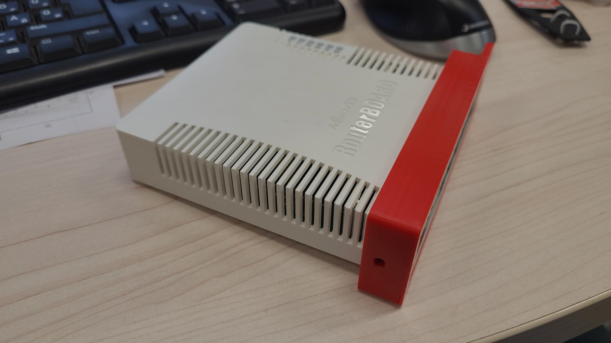
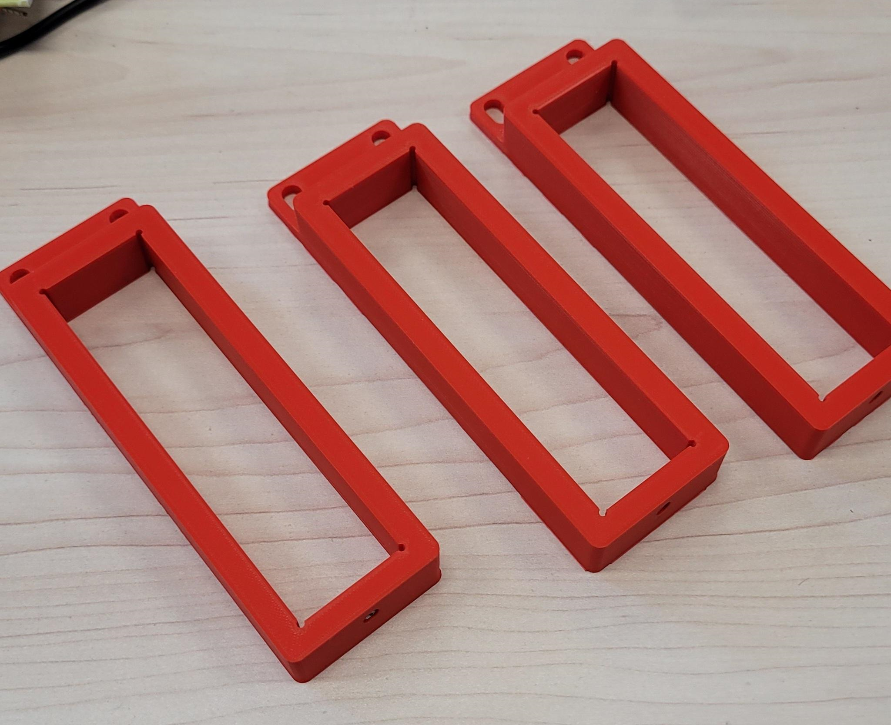

# 1U bracket for RB260

3D printed bracket for [RB260GS](https://mikrotik.com/product/RB260GS) and [RB260GSP](https://mikrotik.com/product/RB260GSP).

 Made by P. Gábor. STL and Ultimaker CAM (Cura) project files included. Uses 4 m filament, which translates to a 3 €/bracket price.

