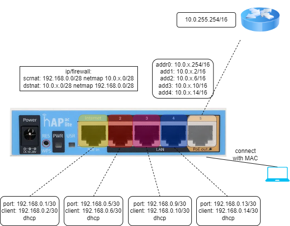
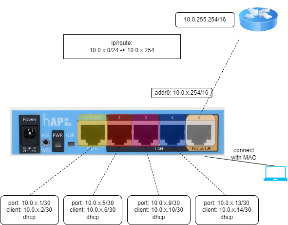

# 4to4 translation

Imagine a factory environment, where each station has its own set of network ports. If we plug a device into the first port then we know that it is measuring air temperature. If we plug the same device into the third port, then it is measuring surface temperature. In case some device fails, then we can get one from the shelf and replace it without any network configuration.

## Idea

* Define /30 networks to each port.
* Use DHCP servers to lease 1 address.
* Solution 1: Use srcnat and dstnat rules to netmap between IP addresses
* Solution 2: Use routes to send traffic to the /30 networks.

*Convert to jinja template and generate the configurations...* - real life usage, not done here.

## Solution 1: Netmap

## Solution 2: Routes

