# VLAN configuration with hardware offloaded switch

Start with empty configuration.

Full configuration file: [vlan-switch hapaclite.rsc](vlan-switch_hapaclite.rsc)

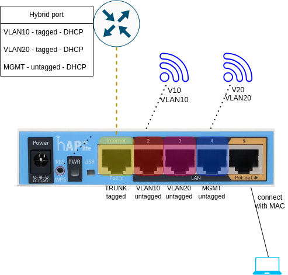

From the external router we get hybrid traffic, which consists of VLAN 10, VLAN 20, and MGMT. The latter is the native traffic (not VLAN tagged).

A külső router-től kapunk hibrid forgalmat, ami áll VLAN 10, VLAN 20 és MGMT-ből. Az utóbbi a natív forgalom (nincs VLAN címkével ellátva).

## Interfaces

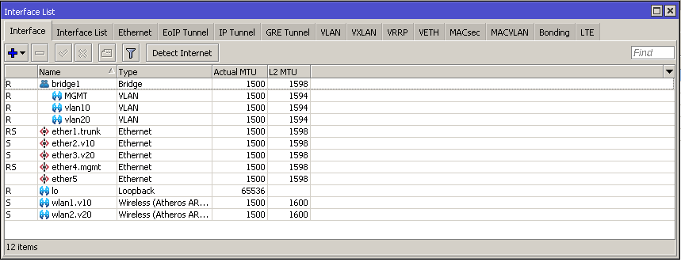

The VLAN interfaces are added to the **bridge1**. The MGMT is packed into **VLAN 1**, this is done by the switch chip.

A VLAN csatolók a **bridge1**-hez kerülnek hozzáadásra. Vegyük észre, hogy az MGMT a **VLAN 1**-ben van. Ezt a switch chip beállítása okozza.

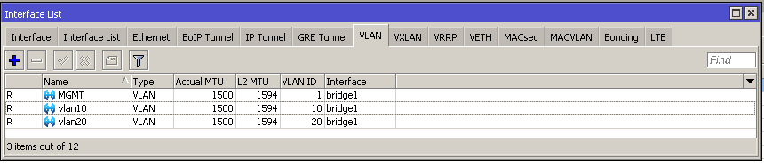

```RouterOS
/interface bridge add name=bridge1
/interface ethernet set [ find default-name=ether1 ] name=ether1.trunk
/interface ethernet set [ find default-name=ether2 ] name=ether2.v10
/interface ethernet set [ find default-name=ether3 ] name=ether3.v20
/interface ethernet set [ find default-name=ether4 ] name=ether4.mgmt
/interface wireless set [ find default-name=wlan1 ] band=2ghz-onlyn country=hungary disabled=no frequency=2472 installation=indoor mode=ap-bridge name=wlan1.v10 radio-name="Mikrotik VLAN10" ssid=V10 vlan-id=10 vlan-mode=use-tag wmm-support=enabled wps-mode=disabled
/interface wireless set [ find default-name=wlan2 ] band=5ghz-onlyac channel-width=20/40/80mhz-eCee country=hungary disabled=no frequency=5200 installation=indoor mode=ap-bridge name=wlan2.v20 radio-name="MikroTik VLAN20" ssid=V20 vlan-id=20 vlan-mode=use-tag wmm-support=enabled wps-mode=disabled
/interface vlan add interface=bridge1 name=MGMT vlan-id=1
/interface vlan add interface=bridge1 name=vlan10 vlan-id=10
/interface vlan add interface=bridge1 name=vlan20 vlan-id=20
/interface wireless security-profiles set [ find default=yes ] supplicant-identity=MikroTik
```

## Bridge

A normal bridge configuration, without VLANs.

Csak egy általános bridge beállítás, VLAN-ok nélkül.

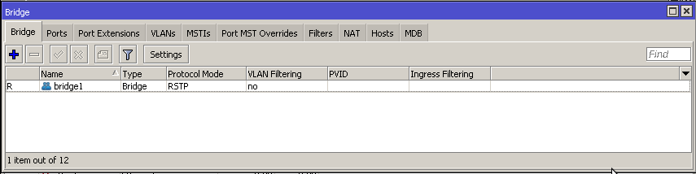
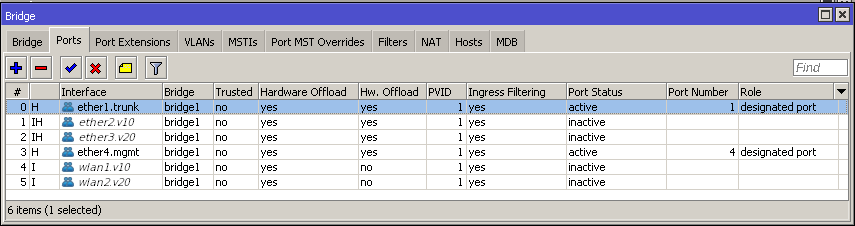
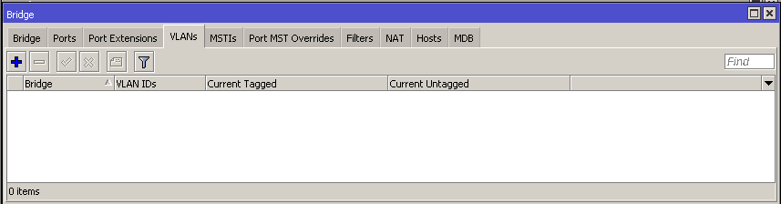

```RouterOS
/interface bridge port add bridge=bridge1 interface=ether1.trunk
/interface bridge port add bridge=bridge1 interface=ether2.v10
/interface bridge port add bridge=bridge1 interface=ether3.v20
/interface bridge port add bridge=bridge1 interface=ether4.mgmt
/interface bridge port add bridge=bridge1 interface=wlan1.v10
/interface bridge port add bridge=bridge1 interface=wlan2.v20
```

## Switch

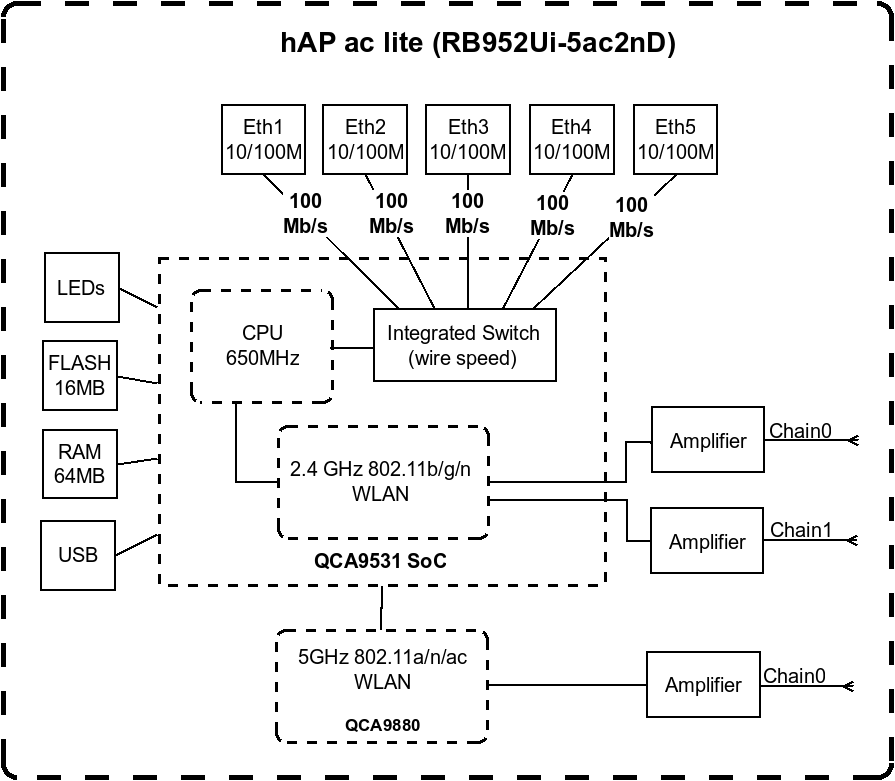

The **hAP ac lite** has an **Atheros8227** switch chip, which has to be configured as a switch to preserve hardware offloading when using VLANs. If there is no need for hardware offloading, then we can use Bridge VLAN filtering.

A **hAP ac lite**-ban **Atheros8227** switch chip van. Ha a hardveres gyorsítást szeretnénk megőrizni akkor a VLAN beállításokat itt kell alkalmazni. Ha nincs rá szükség, akkor maradhatunk a Bridge VLAN szűrésnél.

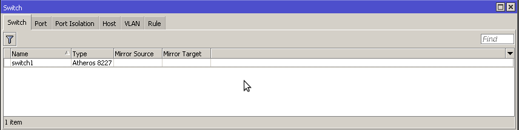

The switch chip behaves as if the CPU port was connected to a separate switch. The CPU sees the switch through **bridge1**, and from the other side the **switch1-cpu** port is the connection. The idea is that the hybrid traffic from the external router is transformed into trunk traffic (we set the default VLAN ID to 1) and distribute it.

A switch chip úgy viselkedik, mintha a CPU portjára még egy külön switch rákerülne. A CPU ezt a **bridge1**-en keresztül látja, a switch oldaláról pedig ez a port a **switch1-cpu**. A gondolat az, hogy a külső router felől érkező hibrid forgalmat trönkösítjük (az alapértelmezett VLAN ID-t 1-re állítjuk) és ezt osztjuk szét.

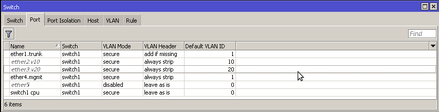

```RouterOS
/interface ethernet switch port set 0 default-vlan-id=1 vlan-header=add-if-missing vlan-mode=secure
/interface ethernet switch port set 1 default-vlan-id=10 vlan-header=always-strip vlan-mode=secure
/interface ethernet switch port set 2 default-vlan-id=20 vlan-header=always-strip vlan-mode=secure
/interface ethernet switch port set 3 default-vlan-id=1 vlan-header=always-strip vlan-mode=secure
/interface ethernet switch port set 5 vlan-mode=secure
```

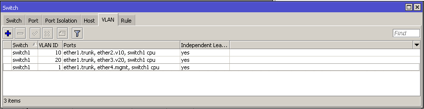

```RouterOS
/interface ethernet switch vlan add ports=ether1.trunk,ether2.v10,switch1-cpu switch=switch1 vlan-id=10
/interface ethernet switch vlan add ports=ether1.trunk,ether3.v20,switch1-cpu switch=switch1 vlan-id=20
/interface ethernet switch vlan add ports=ether1.trunk,ether4.mgmt,switch1-cpu switch=switch1 vlan-id=1
```

## Other

This is just to check the configuration. We use DHCP clients. As expected only the vlan1, vlan10, vlan20 clients get good address. The bridge1 does not see any DHCP servers.

Ez a rész csak ellenőrzés miatt. DHCP klienseket használunk. Ahogy várható volt csak azok a kliensek kapnak jó címet, akik a vlan1, vlan10, vlan20 interfészeken lógnak. A bridge1 nem lát rá egyetlen DHCP szerverre sem.

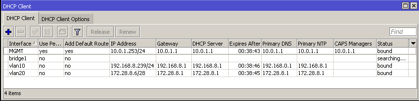

```RouterOS
/ip dhcp-client add interface=MGMT
/ip dhcp-client add add-default-route=no interface=vlan10 use-peer-dns=no use-peer-ntp=no
/ip dhcp-client add add-default-route=no interface=vlan20 use-peer-dns=no use-peer-ntp=no
/ip dhcp-client add add-default-route=no interface=bridge1 use-peer-dns=no use-peer-ntp=no
/ip smb shares set [ find default=yes ] directory=pub
/system clock set time-zone-name=Europe/Budapest
/system note set show-at-login=no
/system ntp client set enabled=yes
/system ntp client servers add address=3.openwrt.pool.ntp.org
/system ntp client servers add address=1.openwrt.pool.ntp.org
/system ntp client servers add address=2.openwrt.pool.ntp.org
/system ntp client servers add address=0.openwrt.pool.ntp.org
/system package update set channel=development
/tool romon set enabled=yes
```

We can give static addresses to the VLAN interfaces, and set up DHCP servers, but this is out of scope.

Adhatnánk statikus címeket a VLAN csatolóknak, és DHCP szervert pattinthatnánk rájuk. De ez túlmutat a mostani témán.

## References

* [BasicVLANswitching](https://help.mikrotik.com/docs/display/ROS/Basic+VLAN+switching#BasicVLANswitching-Otherdeviceswithabuilt-inswitchchip)
* [SwitchChipFeatures](https://help.mikrotik.com/docs/display/ROS/Switch+Chip+Features#SwitchChipFeatures-Introduction)